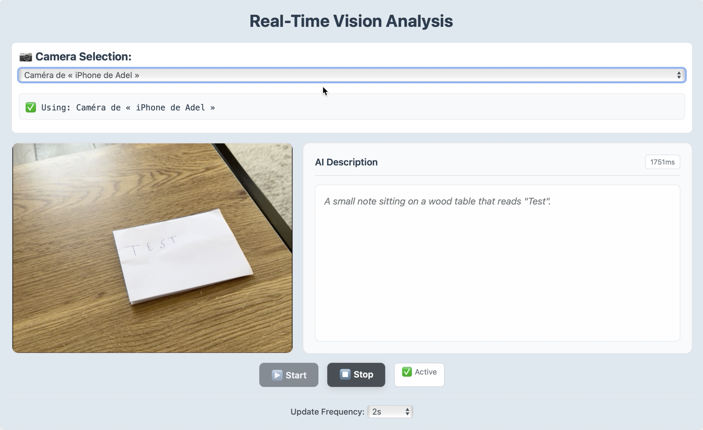

# Real-Time AI Vision Analysis with SmolVLM

<p align="center">
  
  <a href="https://huggingface.co/AdelMessaoudi-13">
    
  </a>
  <a href="https://github.com/AdelMessaoudi-13">
    
  </a>
  <a href="https://www.linkedin.com/in/adel-messaoudi-831358132">
    
  </a>
</p>

<p align="center">
  
</p>

A web-based application that performs real-time AI vision analysis using your webcam or iPhone/smartphone camera. It describes the scene captured by the selected camera in real time using **SmolVLM**.


## Features

- 🎥 Automatic camera detection (webcam, iPhone camera...)  
- 🤖 Real-time AI description using **SmolVLM**  
- 📷 Switchable multiple camera support
- ⚡ Customizable update frequency (from **500ms** to **10s**)  

## Setup & Usage

1. Download and install [llama.cpp](https://github.com/ggml-org/llama.cpp).

2. Start the server locally with the SmolVLM 500M model:

   ```bash
   llama-server -hf ggml-org/SmolVLM-500M-Instruct-GGUF
   ```
   > 🧪 You can experiment with other compatible models listed [here](https://github.com/ggml-org/llama.cpp/blob/master/docs/multimodal.md).

3. Open the file `realtime_vision.html` in your preferred web browser.

4. From the interface, choose the camera you want to use (e.g., built-in webcam, iPhone/smartphone camera etc.).

5. Press the **Start** button to launch the analysis loop.

6. Modify the update interval if needed — options range from **500ms** to **10s**.

7. Observe how the application provides live scene descriptions along with the response time of the model.

8. (Optional) To change what the model is asked, edit the prompt `"What do you see?"` inside the `analyzeFrame()` function of `realtime_vision.html`:

   ```javascript
   content: [
     { type: 'text', text: 'What do you see?' },
     { type: 'image_url', image_url: { url: `data:image/jpeg;base64,${base64}` } }
   ]
   ```

   You can replace it with any custom instruction — for example: `"What is written in the image?"` or `"Is there a person or a vehicle in the scene?"`.

9. Press **Stop** when you're done.

## 👤 Author

**Adel Messaoudi**  
🎓 PhD in Applied Mathematics and Mechanics  
✉️ [amessaoudi.am@gmail.com](mailto:amessaoudi.am@gmail.com)
